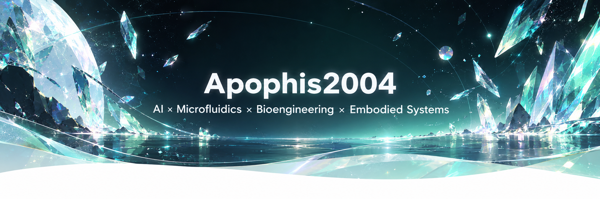

# ✨ Apophis2004

### AI × Microfluidics × Bioengineering × Embodied Systems

  
  
  
  
  

---

## 💎 About Me

I am a research-driven builder working at the intersection of **artificial intelligence, microfluidics, bioengineering, and embodied systems**.

My work focuses on connecting:

**perception → decision → actuation → measurement**

into reproducible experimental systems.

I am especially interested in turning complex research problems into modular, visual, and controllable systems.

---

## 🔷 Research Facets

<table>
<tr>

<td width="50%" valign="top">

### 🌊 Crystal Flow
**Microfluidics & Cell Sorting**

- Microfluidic chip design
- Cell manipulation and sorting
- DEP-based actuation
- Pulsed-flow sorting
- Experimental platform integration
- Closed-loop microfluidic control

</td>

<td width="50%" valign="top">

### 👁️ Optical Perception
**AI & Computer Vision**

- Scientific computer vision
- Cell detection and recognition
- Vision-guided triggering
- Closed-loop experiment control
- Edge AI deployment
- Experimental image analysis

</td>

</tr>

<tr>

<td width="50%" valign="top">

### 🧪 Living Interfaces
**In Vitro Modeling**

- Gastrointestinal in vitro modeling
- Digestion–absorption coupling
- Microfluidic sensing
- TEER / O₂ / pressure readouts
- Gut–microbiome interaction
- Translational validation

</td>

<td width="50%" valign="top">

### 🤖 Embodied Motion
**Robotics & Intelligent Systems**

- Multimodal embodied AI
- Vision + audio + motion integration
- Raspberry Pi robotics
- Human–robot interaction
- Lightweight experimental automation
- Intelligent desktop systems

</td>

</tr>
</table>

---

## ✨ Technical Elements

---

## 🌌 Research Constellation

 

 

---

## 🐍 Contribution Flow

<picture>
  <source media="(prefers-color-scheme: dark)" srcset="https://raw.githubusercontent.com/Apophis2004/Apophis2004/output/github-contribution-grid-snake-dark.svg">
  <source media="(prefers-color-scheme: light)" srcset="https://raw.githubusercontent.com/Apophis2004/Apophis2004/output/github-contribution-grid-snake.svg">
  
</picture>

---

## 🌙 Current Focus

- Vision-guided microfluidic cell sorting
- Closed-loop experimental systems
- Gastrointestinal in vitro modeling
- Microfluidic online sensing
- Embodied AI and robotics
- Research workflow visualization

---

## 💠 Philosophy

> **Structure gives form.  
> Measurement gives meaning.  
> Intelligence connects them.**

 

